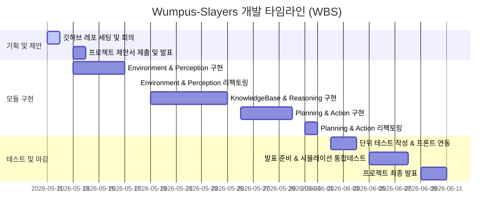
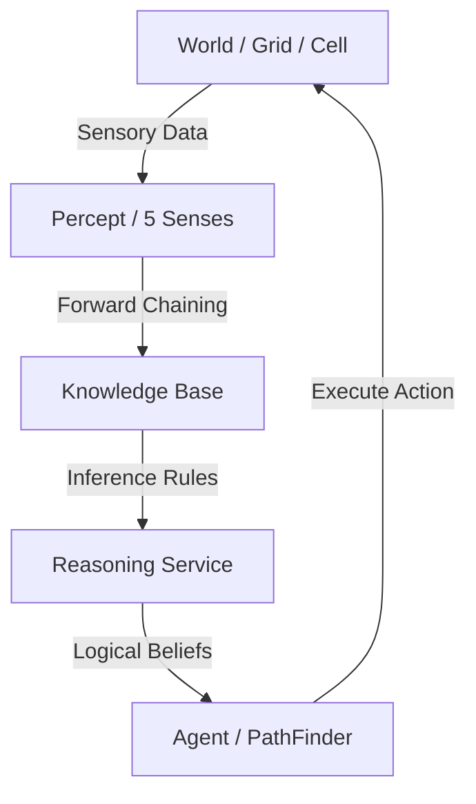
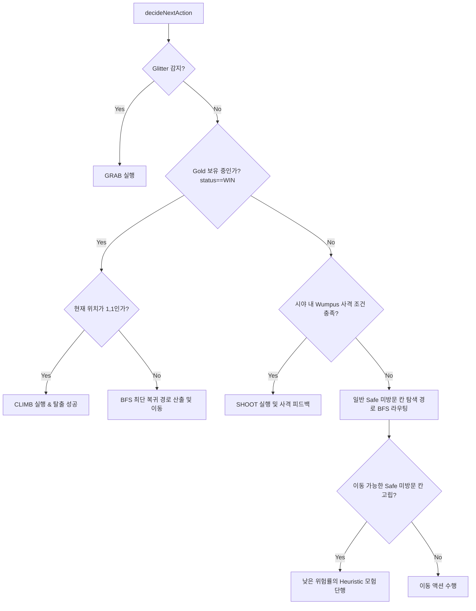

# Wumpus-Slayers (Wumpus World Agent 설계 프로젝트)

## 👾 팀명: WumpusSlayers (움퍼스 슬레이어즈)

AI 에이전트의 지식 베이스(KB, Knowledge Base) 논리 추론과 그래프 탐색 알고리즘을 융합하여, 위험(구덩이, 웜파스 괴물)이 도사리는 4x4 격자 동굴에서 에이전트가 실시간 지각 정보만을 바탕으로 안전하게 금을 찾고 탈출하도록 설계된 **인텔리전트 AI 시뮬레이션 백엔드 시스템**입니다.

---

## 👥 1. 팀원 소개 및 역할

본 프로젝트는 AI 추론과 탐색 알고리즘의 유기적인 연동 및 고도의 시뮬레이션 시각화를 달성하기 위해 아래와 같이 역할을 분담하여 공동 설계 및 구현하였습니다.

| 이름 | 역할 및 담당 업무 |
| :--- | :--- |
| **유한세** | • **Environment & Perception 모듈 설계:** 4x4 동굴 환경 격자 및 실시간 5대 감각(Breeze, Stench, Glitter, Bump, Scream) 감지 시스템 구축.<br>• **KnowledgeBase & 전진 추론 엔진 구축:** 수신된 감각을 토대로 지식을 갱신하는 KB 및 규칙 기반 추론 서비스 구현.<br>• **백엔드-프론트엔드 연동 API 설계:** 실시간 KB 스냅샷 동기화 및 프리미엄 게임 웹 인터페이스 통합 연동. |
| **최환우** | • **Planning & Action 모듈 설계:** 지식 데이터를 바탕으로 에이전트의 차기 최적 행동을 결정하는 의사결정 모델 구축.<br>• **BFS 최단 탐색 및 복귀 알고리즘 최적화:** Safe/Visited 타일을 추려 (1,1)까지 최단 복귀 경로 및 안전 개척 경로를 산출하는 탐색기 최적화.<br>• **테스트 및 품질 검증:** JUnit 단위 테스트 구축 및 예외 시나리오 방어를 통한 시뮬레이션 안정성 확보. |

---

## 📅 2. WBS (Work Breakdown Structure)

캘린더 일정을 기반으로 한 단계별 마일스톤 및 핵심 연구/개발 타임라인입니다.



| 기간 | 작업 내용 | 담당 | 비고 |
| :--- | :--- | :--- | :--- |
| **05.11 ~ 05.12** | 깃허브 협업 레포지토리 구성 및 최초 기획 회의 | 팀 공동 | Git Branch 및 협업 전략 수립 |
| **05.13 ~ 05.14** | 프로젝트 제안서 제출 및 발표 | 팀 공동 | 발표자료 피드백 수렴 |
| **05.13 ~ 05.17** | **Environment & Perception 모듈 설계** | 유한세 | 4x4 Grid, Cell, Percept 모델링 완료 |
| **05.18 ~ 05.18** | Environment & Perception 정제 및 리팩토링 | 최환우 | 방향 회전 관련 예외 코드 보완 |
| **05.19 ~ 05.25** | **KnowledgeBase & Reasoning 전진 추론 구현** | 유한세 | Propositional logic 기반 전진 추론 엔진 완성 |
| **05.26 ~ 05.30** | **Planning & Action 알고리즘 및 BFS 최적화** | 최환우 | BFS 최단 복귀 경로 및 Heuristic 탐색기 완성 |
| **05.31 ~ 06.01** | Planning & Action 리팩토링 및 핑퐁 루프 정화 | 팀 공동 | 제자리 회전 무한 루프 예외 차단 |
| **06.02 ~ 06.04** | JUnit 단위 테스트 보강 및 프론트엔드 REST API 연동 | 팀 공동 | 실시간 추론 상태 조회용 REST API 개설 및 검증 |
| **06.05 ~ 06.08** | 시뮬레이션 통합테스트 및 최종 발표 자료 준비 | 팀 공동 | 게임 환경 시각 피드백 최종 보완 |
| **06.09 ~ 06.11** | **프로젝트 최종 성과 발표 및 시연** | 팀 공동 | 성공적인 탈출률 및 추론 정확도 시연 |

---

## 📂 3. 프로젝트 폴더 구조 (Folder Structure)

백엔드 애플리케이션 소스 코드의 패키지 및 디렉터리 구성도입니다. 도메인 주도 설계(DDD) 사상을 응용하여 계층 및 역할군을 엄격히 분류했습니다.

```
src/main/java/com/wumpusslayers/wumpusworld/
├── WumpusworldApplication.java (애플리케이션 메인 부트스트랩)
├── common (공통 유틸리티 및 전역 설정)
│   ├── enums (Direction, GameStatus, ActionType 열거형)
│   └── exception (예외 처리 클래스)
├── environment (동굴 환경 및 물리 세계 계층)
│   ├── controller (환경 관리 컨트롤러)
│   ├── domain (World, Grid, Cell, Position, Percept 도메인 모델)
│   ├── dto (요청/응답 전송 객체)
│   └── service (WorldGeneratorService, PerceptService 물리 연산)
├── reasoning (지식 베이스 및 논리 추론 계층)
│   ├── controller (추론 분석 컨트롤러)
│   ├── domain (KnowledgeBase, CellBelief, InferenceRule 추론 모델)
│   ├── dto (KbCellDetail, KnowledgeSummaryResponse 등 REST DTO)
│   └── service (ReasoningService, KnowledgeUpdateService, RuleEngineService)
├── agent (AI 에이전트 및 경로 탐색 계층)
│   ├── controller (에이전트 제어 컨트롤러)
│   ├── domain (Agent, AgentState, Action 행동 정의 모델)
│   ├── dto (요청/응답 전송 객체)
│   └── service (AgentService, PathFinderService, ActionPlannerService)
└── simulation (시뮬레이터 기동 및 웹 연동 계층)
    ├── controller (실시간 통합 컨트롤러)
    └── service (GameEngine 시뮬레이션 컨트롤러)
```

---

## 🛠️ 4. 모듈별 세부 구현 내용 (Implementation Details)

Wumpus World AI 엔진은 5대 모듈이 서로 유기적인 데이터 파이프라인을 이뤄 동작합니다.



### 1) 🗺️ World (환경 구성 모듈)
- **4x4 2차원 그리드 시스템:** 이차원 데카르트 좌표계(`Position(x, y)`)를 기반으로 16개의 셀(`Cell`) 정보를 격자 형태로 통합 관리합니다.
- **동적 객체 배치 (`WorldGeneratorService`):**
  - 게임 기동 시 시작 지점 `(1,1)`을 제외한 나머지 15개 격자 중 랜덤한 난수 좌표를 추출하여 구덩이(`Pit`, 생성 확률 약 20%), 웜파스 괴물(`Wumpus`), 금(`Gold`)을 자동으로 배치합니다.
  - 시작 지점 `(1,1)`은 반드시 빈 공간(`visited = true, safe = true`)으로 보장되어 모험의 안전한 기점이 됩니다.
- **에이전트 메타 정보 동적 추적:** 에이전트의 위치(`agentPosition`), 머리 방향(`Direction`: 동, 서, 남, 북), 남은 화살 개수(`arrowCount`, 기본 3개), 게임의 현재 진행 상태(`GameStatus`: PLAYING, WIN, ESCAPED, LOSE_PIT, LOSE_WUMPUS)를 관장합니다.

### 2) 👃 Percept (지각 감지 모듈)
에이전트가 서 있는 물리적인 칸과 주변 환경으로부터 전달받는 5대 지각 데이터를 감지 및 포맷화합니다 (`PerceptService`).
- **바람 (Breeze):** 에이전트의 동/서/남/북 인접 4방향 격자 중 하나 이상에 구덩이(`Pit`)가 존재할 때 지각됩니다.
- **악취 (Stench):** 인접 4방향 격자 중 하나 이상에 살아있는 웜파스 괴물(`Wumpus`)이 도사리고 있을 때 지각됩니다.
- **반짝임 (Glitter):** 에이전트가 위치한 현재 칸에 금(`Gold`)이 놓여있을 때 실시간 지각되며, 이는 곧바로 `GRAB` 액션을 취하는 도화선이 됩니다.
- **벽 부딪힘 (Bump):** 격자의 한계(예: $x=4$에서 동쪽으로 전진 시도)를 돌파하려 할 때 물리학적 충돌 범위를 반환합니다.
- **비명 소리 (Scream):** 화살을 쏘아 먼 곳의 Wumpus를 성공적으로 관통/사살하면 동굴 전체에 울리는 비명 소리를 모든 칸에서 감지합니다.

### 3) 🧠 KB (지식 베이스 모듈)
에이전트의 누적 경험과 탐색 도중 귀납적으로 획득한 명제 논리들을 저장하는 에이전트 전용 로컬 메모리입니다 (`KnowledgeBase`).
- 개별 세션 ID별로 독립적으로 할당되어 병렬 처리가 가능합니다.
- 4x4 각 셀 단위로 다음 6가지 논리 상태 플래그를 정교하게 갱신하며 판단의 근거로 제공합니다:
  - `visited` (방문 여부)
  - `safe` (확정 안전 구역 여부)
  - `possiblePit` / `definitePit` (구덩이 의심 후보 / 100% 확정)
  - `possibleWumpus` / `definiteWumpus` (웜파스 의심 후보 / 100% 확정)

### 4) 🔍 Reasoning (전진 추론 알고리즘)
에이전트가 새로운 격자를 방문해 지각한 Percept 정보를 규칙 엔진에 투입하여 명제 논리적 분해 및 Resolution을 단행합니다 (`RuleEngineService`).

#### 💡 후보칸 (Candidate) 결정 규칙
* **구덩이 후보 (`possiblePit`):**
  - 방문한 셀에서 바람(`Breeze`)이 감지되면, 해당 셀의 인접 격자들 중 **미방문 격자 전체**를 구덩이 후보(`possiblePit = true`)로 잠정 등록합니다.
* **웜파스 후보 (`possibleWumpus`):**
  - 방문한 셀에서 악취(`Stench`)가 감지되면, 아직 정체가 완전히 파악되지 않은 인접 **미방문 격자 전체**를 웜파스 후보(`possibleWumpus = true`)로 잠정 등록합니다.

#### 💡 안전칸 (Safe) 결정 규칙
* **지각 소거법:**
  - 어떤 칸에 직접 들어갔는데 바람(`Breeze`)이 전혀 느껴지지 않는다면, 인접한 4방향 격자에는 구덩이가 전혀 없음($\neg Pit$)이 100% 보장됩니다.
  - 악취(`Stench`)가 나지 않는다면, 인접한 4방향 격자에는 웜파스가 없음($\neg Wumpus$)이 보장됩니다.
  - 따라서 바람과 악취가 동시에 감지되지 않는 청정 칸에 도달하면, 인접한 미방문 격자들은 즉시 확실히 안전한 칸(`safe = true`)으로 격상되며, 의심 후보군(`possiblePit`, `possibleWumpus`)에서 완전히 지워집니다.

#### 💡 확정칸 (Definite) 결정을 위한 Propositional Resolution
* **구덩이 확정 (`definitePit`):**
  - 바람이 감지되었던 칸 $A$ 주변의 인접 미방문 셀들 중, 다른 경로를 통해 들어온 지각 정보로 인해 이웃들이 모두 `safe`로 판정되고, 오직 단 하나의 미방문 격자 $C$만 남은 경우:
    $$Breeze(A) \Rightarrow (Pit(Neighbor_1) \lor Pit(Neighbor_2) \lor \dots \lor Pit(C))$$
    $$\neg Pit(Neighbor_1) \land \neg Pit(Neighbor_2) \land \dots \Rightarrow Pit(C) \text{ [Determined!]}$$
    이 명제 해해(Resolution)에 따라 $C$는 즉시 **구덩이 확정(`definitePit = true`)**으로 마킹됩니다.
* **웜파스 확정 (`definiteWumpus`):**
  - 악취가 나는 칸 주변에서 안전 영역을 소거하고 남은 유일한 후보이거나, 서로 다른 두 악취 격자의 교집합 영역을 찾아내어 오직 1칸으로 웜파스의 은신처가 좁혀지는 즉시 **웜파스 확정(`definiteWumpus = true`)**으로 고정합니다.

---

### 5) 🏃 Action & PathFinder (행동 제어 및 탐색 알고리즘)
추론된 지식 베이스(KB)를 근간으로 삼아, 최적의 탐색 전략과 최단 이동/사격 경로를 결정합니다.



#### 🏹 사격 규칙 (Shoot Action Trigger)
- 에이전트가 화살을 보유하고 있고 (`arrowCount > 0`), 인접 격자의 추론 정보를 통해 웜파스의 위치가 특정 라인 내에 확정 또는 매우 높은 유력 후보로 검출될 때 `SHOOT`을 우선 실행합니다 (`hasShootableWumpus`).
- 화살은 에이전트의 현재 바라보는 머리 방향(동, 서, 남, 북)으로 장애물을 뚫고 직선으로 끝까지 날아가며, 명중 시 즉시 `heardScream = true`와 함께 Wumpus 사망 상태로 갱신되어 월드 격자 내의 웜파스 위험 및 모든 `Stench`를 지식 베이스에서 즉각 해제/소거합니다.

#### 🗺️ BFS 기반 최단 경로 라우팅 (Graph PathFinding)
- **금 획득 시 Safe Return Mode (BFS):**
  - 금(`Gold`)을 성공적으로 획득(`GRAB`)해 게임의 상태가 `WIN`으로 전환되는 즉시, 에이전트는 무모한 탐색을 전면 중단하고 **완전 안전이 보장된 셀(`visited = true` 또는 `safe = true`)들만을 노드로 삼는 BFS(Breadth-First Search) 탐색**을 작동시킵니다.
  - 이 최단 복귀 그래프 상에서 시작 칸 `(1,1)`까지 막힘없이 최단 거리를 산출해 전속력으로 이동하며, `(1,1)` 도달 즉시 동굴을 완전히 빠져나오는 `CLIMB`을 수행하여 완벽한 해피엔딩(ESCAPED)을 만들어냅니다.
- **안전 개척 탐색 (Safe Exploration Mode):**
  - 금을 찾기 전 단계에서는, 머릿속으로 확실히 안전하다고 판정한 미방문 칸들 중 가장 가깝고 효율적인 목적지를 선정하여 BFS 경로로 안전 주행을 펼칩니다.
- **고립 방지 휴리스틱 모험 (Adventure Heuristic Mode):**
  - 주변이 온통 미확정 위험 지역으로 둘러싸여 더 이상 안전하게 갈 수 있는 미방문 타일이 존재하지 않는 고립 상태가 발생하면, 에이전트는 고도의 **위험률 휴리스틱 평가**를 실시합니다.
  - 인접한 미방문 격자들 중 구덩이 가능성 점수가 가장 낮고, 웜파스가 있을 확률이 극히 미미한 칸을 우선순위 큐(Priority Queue) 평가를 거쳐 모험 후보로 낙점하여 위험을 뚫고 개척하는 탐색을 수행합니다.
